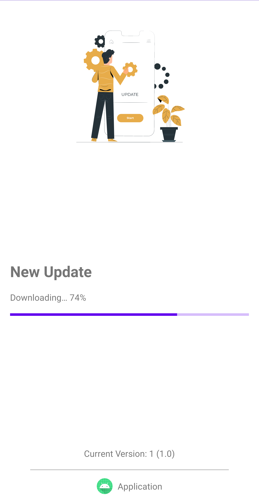
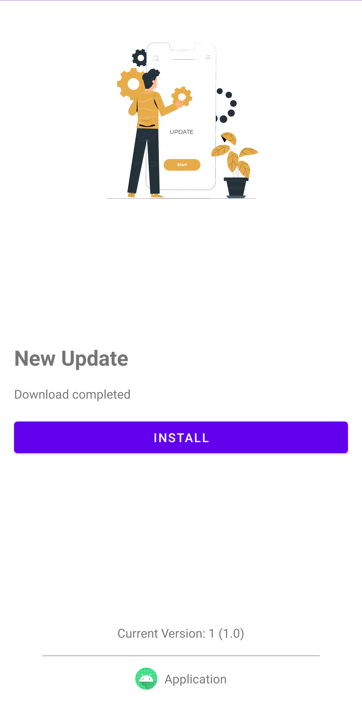
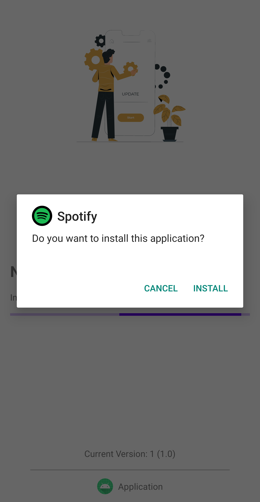

<h3 align="center">Force Update</h3>

<p align="center">This library helps the application to:</p>

<table align="center">
    <tr><td align="center">1</td><td>Force updating the application by only providing the APK link needed.</td></tr>
    <tr><td align="center">2</td><td>Check whether the application need to be updated or not.</td></tr>
    <tr><td align="center">3</td><td>Delete the downloaded APK file if needed.</td></tr>
    <tr><td align="center">4</td><td>Delete application content by clearing all its data.</td></tr>
</table>

##

<h3 align="center">Library Images</h3>

<div align="center" >
    
    
    
    
</div>

##

<h3 align="center">Installation</h3>


[](https://jitpack.io/#Abdulrahman-AlGhamdi/ForceUpdate)

```groovy
allprojects {
    repositories {
        maven { url 'https://jitpack.io' }
    }
}
```

```groovy
implementation 'com.github.Abdulrahman-AlGhamdi:ForceUpdate:tag'
```

##

<h3 align="center">Usage</h3>

* First : 
    * call `ForceUpdateManager` helper class
    * In the constructor you must provide an Activity reference

```kotlin
val forceUpdateManager = ForceUpdateManager(activity = this)
```

* Second : 
    * Call `checkAppVersion` function
    * Provides the new application version to this function as argument 
    * This function will return true or false and that indicate whether you need to update the application or not

```kotlin
forceUpdateManager.checkAppVersion(newVersion = 2)
```

* Third : 
    * Call `updateApplication` to start the force update process
    * Provide the APK file link that is going to be install
    * Provide a header to the download manger if you need
    * Make the update optional or not
    * Change the default loading animation by providing the lottie file name that ends with `.json` <br> (this file must be in the assets folder)

```kotlin
forceUpdateManager.updateApplication(
    apkLink = "APK_LINK",
    header = Pair("header", "value"),
    optional = true,
    animation = "loading.json"
)
```

* Fourth :
    * If you need to destroy the application by clearing its data call `destroyApplication`
    * also you can provide custom message in the function constructor

```kotlin
forceUpdateManager.destroyApplication(dialogMessage = "MESSAGE")
```

##

<h3 align="center">License</h3>

```
Copyright 2021 Abdulrahman Al-Ghamdi

Licensed under the Apache License, Version 2.0 (the "License");
you may not use this file except in compliance with the License.
You may obtain a copy of the License at

    http://www.apache.org/licenses/LICENSE-2.0

Unless required by applicable law or agreed to in writing, software
distributed under the License is distributed on an "AS IS" BASIS,
WITHOUT WARRANTIES OR CONDITIONS OF ANY KIND, either express or implied.
See the License for the specific language governing permissions and
limitations under the License.
```
